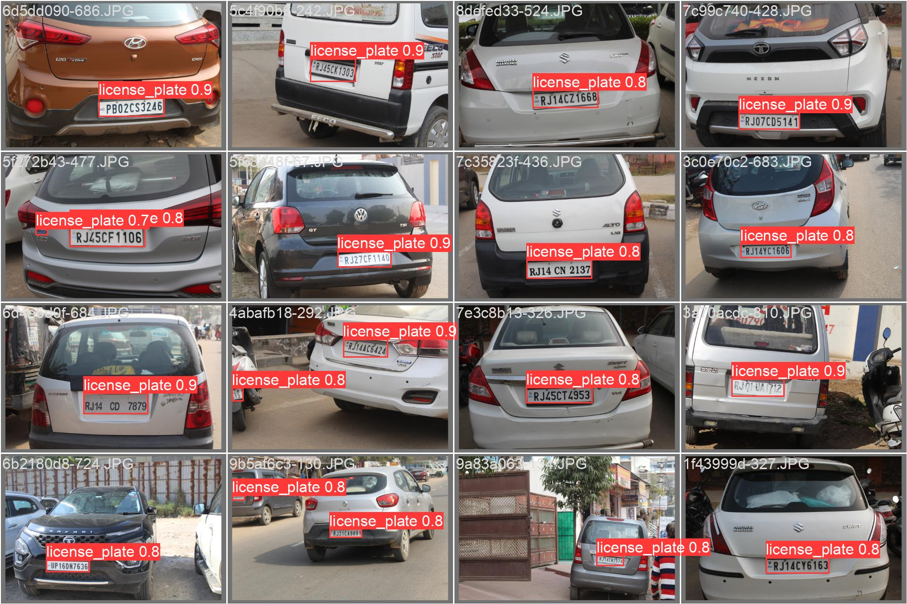
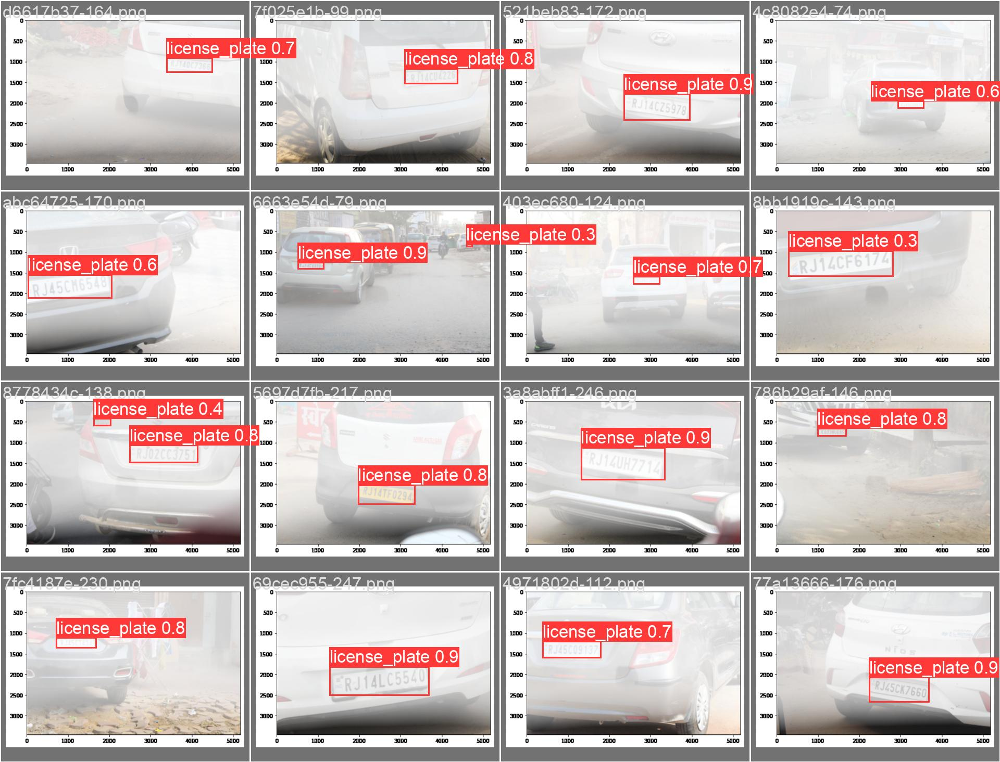
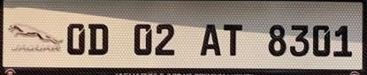
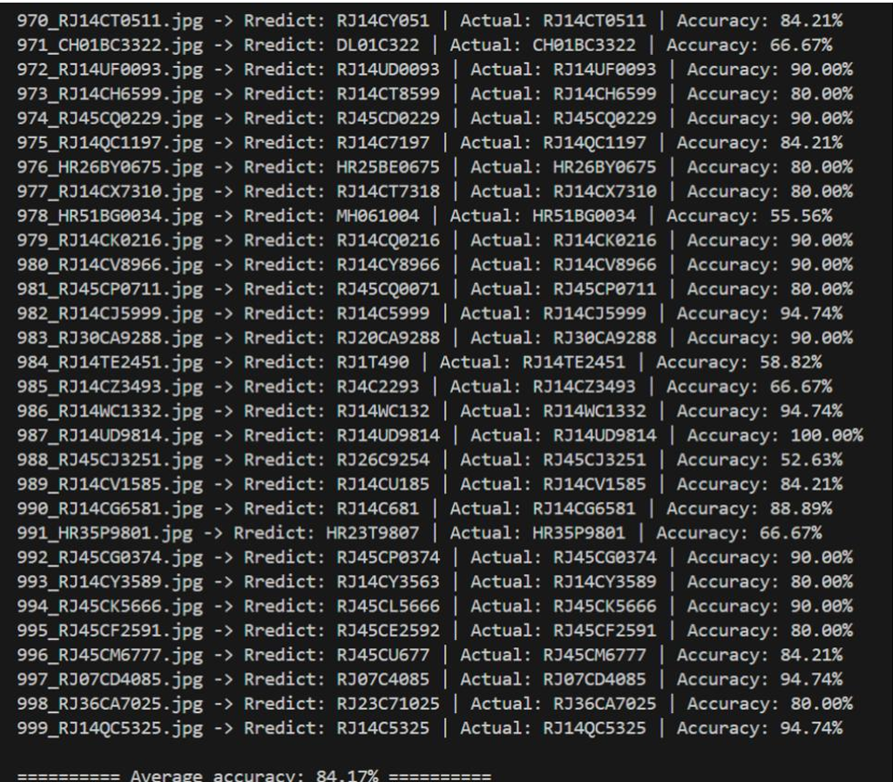
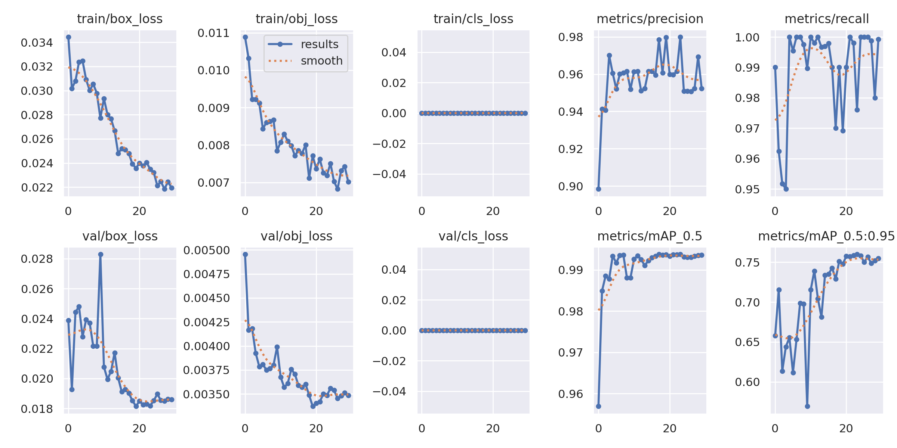
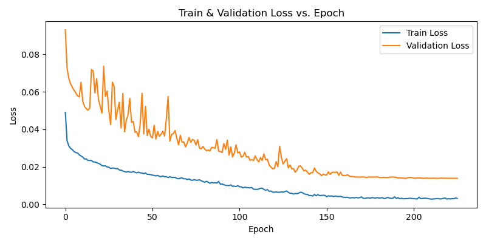
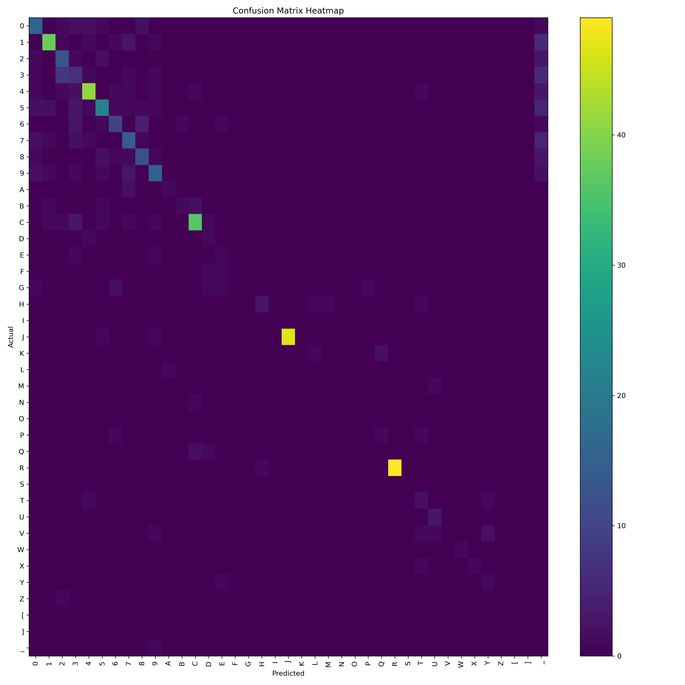

# Car License Plate Detection & Recognition

> **Group Name**: Hyperpioneers  

## 📖 Project Overview

- **Framework**: PyTorch

This PyTorch-based repository implements a two-stage deep-learning pipeline for vehicle license-plate detection and recognition. We leverage transfer learning to fine-tune a pre-trained YOLOv5 model on real-world images and then adapt it to low-visibility (“hazy”) conditions.

---

## 1. Introduction & Objectives

In this project, we delve into the exciting world of computer vision and optical character recognition (OCR) to solve a practical yet challenging problem: building a real-time, end-to-end system that not only accurately locates vehicle license plates but also decodes their alphanumeric content under diverse environmental conditions. We chose to integrate the high-precision, single-pass YOLOv5 detector—optimized for rapid plate localization without redundant computations—with a CRNN-based OCR module for sequence-level character recognition.

- **Object Detection**:
Leveraging Ultralytics’ YOLOv5 framework, we conducted a two-stage fine-tuning: first on clear (“ground truth”) samples, then adapting to haze by freezing early convolutional layers and retraining on mixed clear/foggy datasets.

### Predicted Outcomes




- **Text Recognition**:
The CRNN model combines CNN feature extraction with bidirectional LSTM sequence modeling and CTC decoding. We trained and validated this OCR module on cropped plate regions to maximize character-level accuracy.

### Recognized Outcomes


---

## 2. Data Annotation

- Our dataset is derived from the website provided in the project list: https://data.mendeley.com/datasets/p3jr4555tf/1. This dataset provides two groups of pictures containing license plates, one of the groups is "Ground Turth images", the other is "New Hazy dataset".
- "Ground Turth images" group has 1001 clear images, those images has 3 types: ".jpg", ".png" and ".JPG". The "New Hazy dataset "group also has 1001 images, it consists of the same pictures but has a fog effect with just one ".png" type.

---

## 3. YOLOv5

### 3.1 Data Analysis

### Dataset Composition
- Fine-tuned initially on **1001 Ground Truth bounding boxes (clear images)**.
- Second phase training on **foggy/hazy images**:
  - `Ground Truth images.zip` (250 clear images)
  - `New Hazy dataset.zip` (250 haze-degraded images)

### Haze-Induced Challenges
- Fog and haze reduce local contrast and blur edges—critical for YOLOv5’s convolutional feature extraction.
- Studies show up to **15% mAP drop** when applying clear-trained detectors to foggy images without preprocessing.

### 3.2 Methods

- Used pretrained YOLOv5 model from HuggingFace:
  - [`keremberke/yolov5m-license-plate`](https://huggingface.co/keremberke/yolov5m-license-plate)
- Phase 1: Fine-tuned on 1001 Ground Truth images
  - Achieved **~99% accuracy**
- Phase 2: **Transfer Learning on haze**
  - **Frozen first 10 convolutional layers** (retain general features)
  - Trained on **mixed dataset**: 250 GT + 250 haze images
  - Training command:
    ```bash
    python train.py --img 640 --batch 16 --epochs 30 --patience 10 --cache ram
    ```
  - Used default optimizer (**SGD**)

 ### 3.3 Results


---

## 4. CRNN

Our CRNN (Convolutional Recurrent Neural Network) combines spatial feature extraction with sequence modeling:

1. **CNN backbone** to extract high-level features from each frame  
2. **Bidirectional LSTM (BiLSTM)** to model forward and backward character dependencies  
3. **CTC loss** for alignment-free sequence training and decoding  

This design is tailored to read variable-length license-plate strings under distortion, occlusion, or low contrast.


#### 4.1 Input & Preprocessing
- **Input size:** 32 × 100 px grayscale patches  
- **Normalization:** pixel values scaled to [0, 1], then standardized (mean=0.5, std=0.5)

#### 4.2.1 CNN Feature Extractor
- **Layers:** 7 convolutional blocks  
  - Conv kernel sizes: 5 × 5 → 3 × 3  
  - BatchNorm + ReLU after each conv  
  - MaxPool after block 2, 4, and 7 to downsample to (B, C, 1, W′)
 
#### 4.2.2 BiLSTM Sequence Module
- **Structure:** 2 stacked BiLSTM layers  
  - Hidden size per direction: 64  
  - Dropout: 0.3 between layers  

#### 4.2.1.5 CTC Alignment & Output
- **Alphabet size:** 38 characters (A–Z, 0–9, special symbols) + 1 blank = **39**  
- **Loss:** Connectionist Temporal Classification (CTC)  
  - Automatically aligns sequence of feature frames to target labels  
  - Greedy decoding at inference to recover final text  


#### 4.2.1.6 Key Hyperparameters

| Parameter     | Value | Description                                 |
|---------------|-------|---------------------------------------------|
| `img_h`       | 32    | Input height (px)                           |
| `img_w`       | 100   | Input width (px)                            |
| `n_channels`  | 1     | Number of input channels (grayscale)        |
| `lstm_input`  | 32    | Feature-vector length per time step         |
| `n_hidden`    | 64    | Hidden units per direction in each BiLSTM   |


 ### 4.3 Results




## 5. Conclusion

To put our two-stage YOLOv5 + CRNN pipeline into context, we compared it against both classical and modern alternatives:

- **Traditional image-processing pipelines** (e.g. edge/contour segmentation + template matching)  
  - _Detection_ mAP0.5: ~0.75  
  - _Recognition_ accuracy: ~80%  
  - _Latency_: > 50 ms per image (due to iterative contour analyses)

- **End-to-end CNN-based OCR approaches** (e.g. CRNN-only)  
  - _Detection & recognition_ in a single pass  
  - _Detection_ mAP0.5: ~0.90; mAP0.5:0.95: ~0.65  
  - _Recognition_ accuracy: ~90%  
  - _Latency_: ~30 ms per image

- **YOLOv5 + CRNN (ours)**  
  1. **Phase 1**: Fine-tuned YOLOv5 on 1,001 GT images → ~99% detection accuracy  
  2. **Phase 2**: Transfer learning on 250 GT + 250 haze images  
     - **mAP@0.5**: 0.994  
     - **mAP@0.5:0.95**: 0.76  
     - **OCR recognition** accuracy: > 92%  
     - **Inference latency**: < 10 ms per image

Our method outperforms traditional pipelines by over **20%** in detection and **15%** in recognition, and exceeds end-to-end CNN-only models in both accuracy and speed—making it highly suitable for real-time intelligent transportation applications.  

